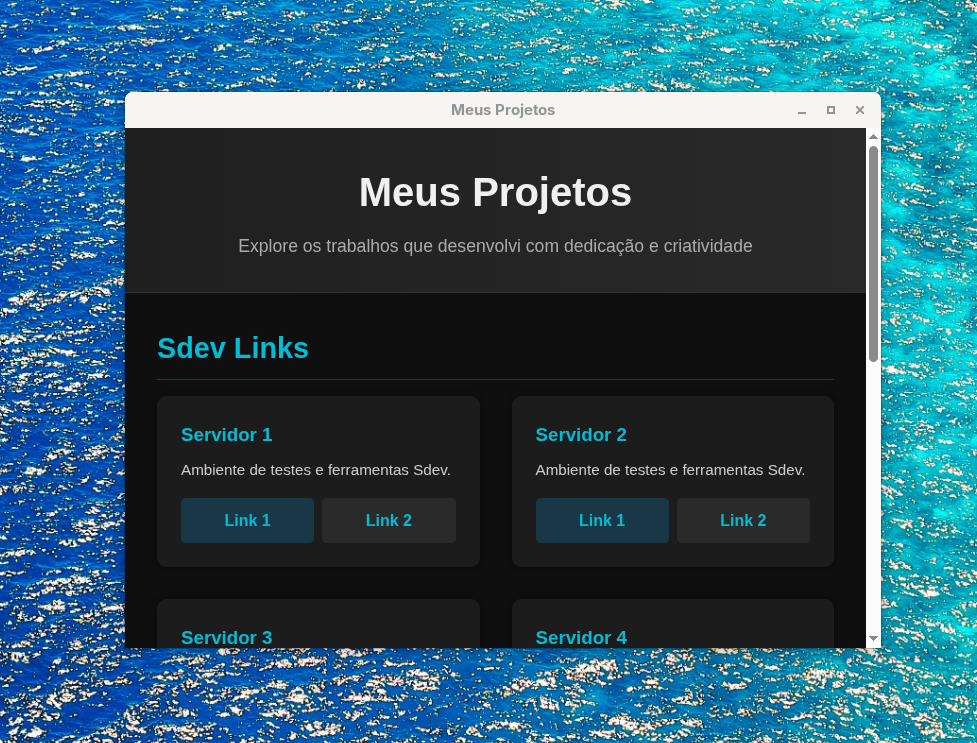
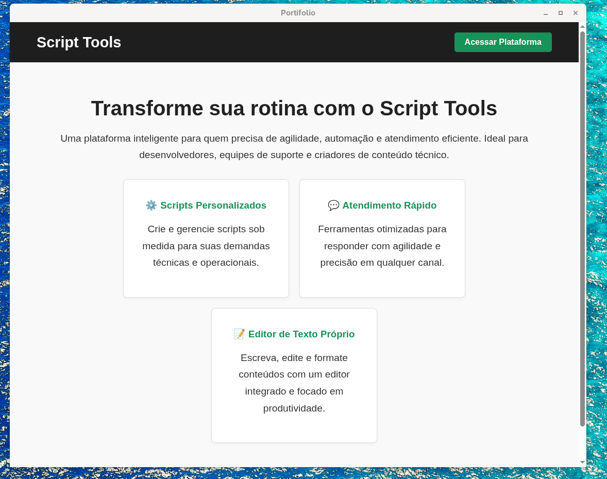
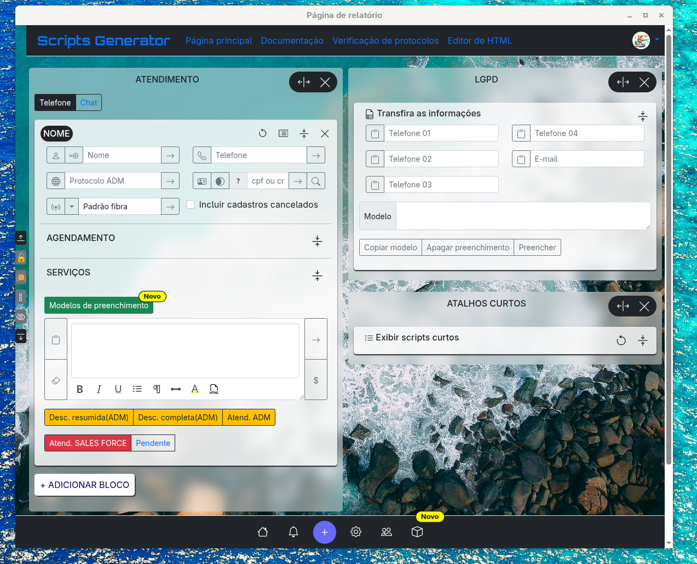
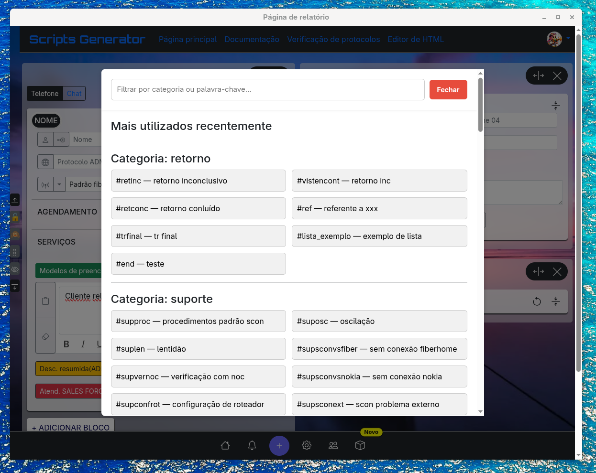
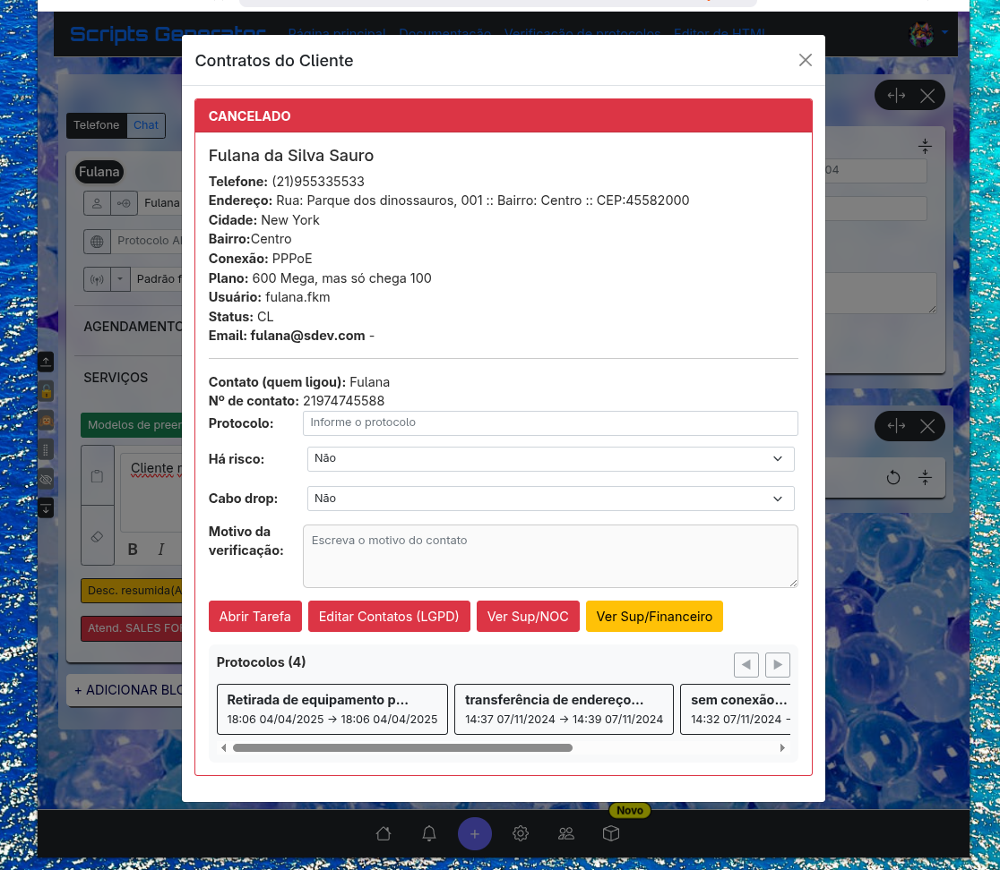

# 🌟 Script Tools  
**Seu assistente multiplataforma para produtividade, organização e desempenho na geração de textos personalizados.**  
Compatível com **Windows**, **Linux (AppImage)** e **macOS**.

---

## 📥 Download

Escolha a versão adequada para o seu sistema operacional:

| Sistema Operacional | Tipo de Arquivo | Link de Download |
|---------------------|-----------------|------------------|
| 🪟 Windows | Instalador (.exe) / Portable (.zip) | [Baixar Windows](https://github.com/sdevawsm/script-tools-app/releases/download/1.0.0/ScriptTools.App.1.0.0.exe) |
| 🪟 Windows | Instalador (.exe) / Installer (.zip) | [Baixar Windows](https://github.com/sdevawsm/script-tools-app/releases/download/1.0.0/ScriptTools.App.Setup.1.0.0.exe) |
| 🐧 Linux | AppImage (.AppImage) | [Baixar Linux](https://github.com/sdevawsm/script-tools-app/releases/download/1.0.0/ScriptTools.App-1.0.0.AppImage) |
| 🍎 macOS | Aplicativo (.dmg) | [Baixar macOS](https://github.com/sdevawsm/script-tools-app/releases/download/1.0.0/ScriptTools.App-1.0.0.dmg) |

---

## 🖼️ Interface do Aplicativo

### Tela Inicial  



### Editor de Scripts  





---

## ⚙️ Recursos

- Interface intuitiva e responsiva  
- Sincronização de dados entre plataformas  
- Modo escuro e claro  
- Suporte a múltiplos idiomas  
- Atualizações automáticas  
- Geração de scripts personalizados  
- Temas personalizados  
- Botões de acesso rápido  
- Modelos de preenchimento  
- Integração com sistemas  

---

## 🚀 Instalação

### Windows
- **Instalador**: Execute o `.exe` e siga as instruções.  
- **Portable**: Extraia o `.zip` e execute o arquivo principal.  

### Linux
Dê permissão de execução ao arquivo .AppImage e inicie o aplicativo:

```bash
chmod +x nome-do-app.AppImage
./nome-do-app.AppImage

```

### macOS
Dê um duplo clique no arquivo .dmg baixado.

Quando a janela do instalador abrir, arraste o ícone do Script Tools para a pasta “Aplicativos”.

Após a cópia ser concluída, acesse a pasta Aplicativos e abra o Script Tools.

Caso o macOS exiba um aviso de segurança (“Aplicativo baixado da Internet”), vá em:
Preferências do Sistema → Segurança e Privacidade → Geral → Permitir Abrir Mesmo Assim.

